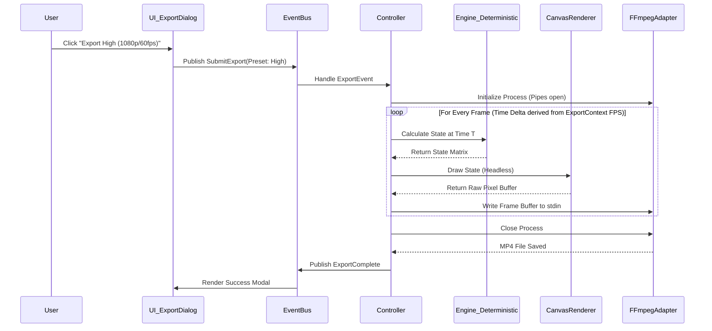

# Technical Design Document: Vector Vibe Animator

## 1. System Overview

The Vector Vibe Animator will be built using a **Modular Event-Driven Architecture** combined with a **Hexagonal (Ports and Adapters)** pattern.

### Architectural Patterns Explained
1. **Reactive State & Event-Driven Architecture:** The application uses a hybrid approach. The React UI layer is strictly driven by **Reactive State** (Zustand), meaning components bind to state properties and dispatch mutations directly to the store without an intermediate event bus. However, the core Engine and background modules (Audio Engine, Export Manager) use an **Event-Driven Architecture** via an `EventBus` for asynchronous lifecycle events (e.g., `AudioPlaybackStarted`, `FFmpegExportFailed`). This means the UI directly reads/mutates what things look like, but emits a `PlayRequestedEvent` to orchestrate playback.
2. **Hexagonal (Ports and Adapters) Pattern:** This pattern mandates that the core application domain (the pure math, geometry, and vector state of the animator) sits isolated at the center. It communicates with the outside world (the UI, the local file system, the system audio player, FFmpeg) through defined interfaces ("Ports"). We then write specific "Adapters" (like an `FFmpegExportAdapter`, `WebAudioAdapter`, or `LiveAudioAdapter`) that plug into those ports. The core engine never knows *how* audio is played or *how* files are saved, it only knows that it has an adapter capable of doing so.

**Why this supports the roadmap:**
In a local desktop environment handling both real-time UI/canvas updates and heavy background processing (like audio syncing and FFmpeg rendering), an event-driven core ensures UI threads are never blocked by long-running operations. Concurrently, the Hexagonal structure separates the core application logic (geometry, animation physics) from external concerns (file system I/O, audio playback engine, FFmpeg execution). This separation guarantees that when Phase 3 introduces complex physics or Phase 4 introduces external CLI integrations (FFmpeg), the core data structure and drawing mechanics introduced in Phase 1 remain completely untouched.

## 2. The Roadmap Evolution

### Phase 1: Core Engine & Visualization MVP
* **Phase Objective:** Establish foundational geometry, canvas rendering, and interaction mechanics.
* **Architectural Impact:** Introduces the core rendering loop, state management for the canvas, and the JSON serialization schema for shapes and layers.
* **Design Hooks & Hook Strategy:** 
  * **Hook Strategy (Open/Closed Principle):** By injecting dummy 'Animation' and 'Audio' adapters into the core entity loop at initialization (`new Engine(new StubAudioAdapter(), new StubAnimationEngine())`), the core simulation obeys the Open/Closed Principle. In Phase 1, `StubAnimationEngine.getDisplacement()` will always return 0, and `StubAudioAdapter.getTime()` will be driven by a basic timer. When Phase 2 and Phase 3 arrive to actualize mechanics, we merely pass new concrete implementations into the constructor. The Phase 1 lines of code rendering the vector points *will not be touched* or modified, staying perfectly closed for modification while open for extension.
  * `IAnimationEngine`: An API interface created now for shape point displacement.
  * `EventBus`: A central messaging broker keeping UI tools and the core Canvas state decoupled.

### Phase 2: Audio/Timeline Authoring Logic
* **Phase Objective:** Build the temporal sequencing structure mapping animation points to an audio track timeline. Introduces DAW-standard navigation (Zoom, Pan, and Auto-scroll).
* **Architectural Impact:** Introduces a `TimelineManager` and `AudioPlaybackAdapter`. The core `EventBus` expands to handle `TimeUpdateEvent` and `PlaybackStateEvent`.
* **Design Hooks:**
  * `ITimeSource`: Interface representing over-arching playback time. In this phase, it hooks to the local audio track. In the future (Phase 4), this allows headless rendering by passing a synthetic time source that jumps ahead programmatically.
  * `AbstractMarker`: Base class for timeline markers, preparing for potential new marker types.
  * **Viewport Logic:** The timeline UI must reactively handle `timelineZoomLevel` and `timelineScrollOffsetPx`. During playback, if the playhead exceeds the viewport bounds, the system must dispatch a scroll offset update to ensure the playhead remains visible (Auto-scroll).

### Phase 3: Physics & Animation
* **Phase Objective:** Implement the 1D wave equation propagating from the Pluck Origin handle and constructive interference logic.
* **Architectural Impact:** The `IAnimationEngine` is fully implemented with complex physics algorithms. Introduces a `PhysicsWorker` to offload heavy wave calculations from the main thread.
* **Design Hooks:**
  * `IWavePropagationStrategy`: A Strategy pattern interface. Currently implementing the 1D wave equation, but leaves the door open for future physics models (e.g., standing waves, spring systems) without modifying the shape definitions.

### Phase 4: Polish & Export Media
* **Phase Objective:** Finalize media export via FFmpeg and image cropping/importing.
* **Architectural Impact:** Integrates the `FFmpegExportAdapter`. Modifies the serialization/deserialization logic to handle a new `FreeFloatingBoundedObject` (images).
* **Design Hooks:**
  * `IExportPipeline`: Interface defining the export contract. Prepares the system for future export media targets.
### Phase 5: Real-Time Audio & Live Performance
* **Phase Objective:** Enable responsive animation from external sound sources.
* **Architectural Impact:** Introduces a `LiveAudioAdapter` and an `AudioDeviceManager`. The `IAnimationEngine` is updated to handle reactive triggers in addition to temporal markers.
* **Design Hooks:**
  * `IAudioTriggerSource`: An interface that provides real-time amplitude/frequency data.
  * `TriggerStrategy`: A pattern for defining "Pluck" events based on audio thresholds.

## 3. Data Strategy

The `.vva` project schema uses a normalized, relational JSON structure, avoiding deep DOM-like nesting for overall entities while keeping instance-specific animation data tightly coupled to its parent shape.

```json
{
  "version": "1.0",
  "projectSettings": {
    "dimensions": {"width": 1080, "height": 1080},
    "backgroundColor": "#FFFFFF",
    "exportDefaults": {"resolution": "1080p", "fps": 60}
  },
  "assets": {
    "images": [{"id": "img1", "path": "./local/assets/img1.png", "bounds": {"w": 200, "h": 200}}]
  },
  "audio": {
    "tracks": [{"id": "trk1", "path": "./local/audio/bgm.mp3"}],
    "markers": [
      {"id": "mk1", "targetTrackId": "trk1", "timestampMs": 1500, "name": "M1"},
      {"id": "mk2", "targetTrackId": "trk1", "timestampMs": 4000, "name": "M2"}
    ]
  },
  "entities": {
    "shp1": {
      "id": "shp1",
      "type": "Line",
      "zIndex": 1,
      "style": {"strokeColor": "#FF0000", "strokeWidth": 2, "fillColor": "transparent", "globalRadius": 5},
      "geometry": {"vertices": [], "pluckOrigin": 0.5},
      "animations": [
        {
          "id": "anim1",
          "startMarkerId": "mk1",
          "endMarkerId": "mk2",
          "frequency": 5,
          "amplitude": 10,
          "easing": "Exponential",
          "trigger": {
            "type": "Reactive", // or "Temporal"
            "threshold": 0.5,
            "frequencyBand": "Bass"
          }
        }
      ]
    },
    "img1": {
      "id": "img1",
      "type": "Image",
      "zIndex": 0,
      "assetId": "img1",
      "geometry": {"x": 0, "y": 0, "width": 1080, "height": 1080}
    }
  }
}
```
*Growth Account:* Entities are stored in a flat dictionary keyed by string IDs (`Record<string, CanvasEntity>`), allowing O(1) lookups and easy Z-order sorting via a separate ID array. Animations are nested directly within the `Line` entity they modify, mapping to the Phase 3 requirement of "constructive interference on the same line segment" without forcing the 60fps render loop to perform expensive global relational lookups. Image entities are fully supported as a distinct polymorphic type.

## 4. Extensibility Patterns

* **Strategy Pattern:** Used for calculating the `AnimEasing` (Linear vs. Exponential) and the 1D wave physics inside the `IWavePropagationStrategy`. When new mathematical decays or wave mechanisms are requested, a new Strategy class is added without altering the engine.
* **Observer Pattern / EventBus:** The `TimelineManager`, `CanvasEditor`, and `PropertiesPanel` will act as discrete observers of a central application state. 
* **Dependency Injection:** The core application bootstrapper injects interface adapters. This prevents tight coupling.

## 5. Constraints & Risks

**High Integration Risk:** **Phase 4 (FFmpeg Local Execution Pipeline)**
* *Why:* Tying the precise visual state of a front-end canvas (tied to imperfect real-time clocks) to an external FFmpeg binary is notoriously desync-prone. 
* *Risk:* The UI preview may stutter or run at an imperfect framerate locally, but the MP4 output *must* be perfectly framed and synced to the generated audio packet.
* *Mitigation:* The `IAnimationEngine` must be purely deterministic, relying entirely on the `timestampMs` input variable rather than frame-to-frame delta times. During Phase 4 export, the system cannot record the UI canvas live. Instead, it will manually step the internal engine via a headless render loop, passing precise 1/FPS timestamps derived from the Export Preset to capture each frame individually before piping the raw pixels to FFmpeg.

## 6. Architecture Visuals

### Day in the Life of a Request (Export Flow)



### Phase Matrix Table

| Requirement Component | Architectural Module | Phase Introduced | Extensibility / Notes |
| :--- | :--- | :--- | :--- |
| **Canvas Coordinates / Vectors** | Core Geometry Engine | Phase 1 | Flat arrays, decoupled from visual styling rules. |
| **Z-Ordering** | Application State Model | Phase 1 | Handled via array indices in the State store. |
| **Animation Interface** | `IAnimationEngine` | Phase 1 | **Hook:** Stubbed early to support Phase 3 physics with zero refactoring. |
| **.vva Project Files** | Storage Adapter | Phase 1/2 | JSON text representation alongside audio files in directory. |
| **Audio Waveform / Playback** | `AudioPlaybackAdapter` | Phase 2 | Realtime integration decoupled via `ITimeSource`. |
| **Pluck Physics / Math** | `IWavePropagationStrategy` | Phase 3 | Mathematical logic abstracted via Strategy Pattern. |
| **Video Rendering (MP4)** | `FFmpegExportAdapter` | Phase 4 | Handled purely through deterministic headless stepping. |
| **Image Cropping** | `UI Modals` & `ImageCanvasEntity` | Phase 4 | Extends Phase 1 core logic for non-vector geometry. |
| **Real-Time Audio** | `LiveAudioAdapter` | Phase 5 | Reactive triggering via Web Audio `AnalyserNode`. |

## 7. Detailed Blueprint: Phase 1 (Core Engine & Visualization MVP)

This section provides a granular implementation guide for Phase 1, focusing on establishing the architecture that will support all future phases.

### 7.1 Technology Stack (Phase 1)
*   **Language:** TypeScript (for strict typing of interfaces and domain models).
*   **UI Framework:** React (for robust state-driven UI components like toolbars and properties panels).
*   **Build Tool/Bundler:** Vite
*   **Desktop Environment:** Electron 
    * *In Phase 1*, this provides local file system access (e.g., via the [Node.js `fs` module](https://nodejs.org/api/fs.html) in the `main` process) for saving/loading `.vva` JSON projects and copying audio assets into the project directory. 
    * *In Phase 4 (FFmpeg Integration)*, Electron's Node.js backend (`main` process) is critical. We cannot reliably render high-quality MP4s entirely in the browser DOM. Instead, the `main` process will use Node's `child_process.spawn()` to execute a bundled or system-installed FFmpeg binary. The React `renderer` process will headless-render the canvas frame-by-frame, convert them to raw binary buffers, and securely pipe those buffers over Electron's IPC (Inter-Process Communication) to the `main` process, which then pipes them directly into FFmpeg's `stdin`. This guarantees perfectly locked framerates regardless of how long each frame takes to calculate. 
    * *References:* [Node.js child_process.spawn()](https://nodejs.org/api/child_process.html#child_processspawncommand-args-options), [Electron IPC Communication](https://www.electronjs.org/docs/latest/tutorial/ipc), [FFmpeg image2pipe muxer](https://ffmpeg.org/ffmpeg-formats.html#image2pipe)
*   **Canvas Rendering:** HTML5 `<canvas>` API (2D Context). While WebGL (via PixiJS or Three.js) is faster, the 2D Context is sufficient for vector line drawing and vastly simplifies the deterministic headless rendering required in Phase 4.
*   **State Management:** [Zustand](https://docs.pmnd.rs/zustand/getting-started/introduction). It provides a lean, hook-based store that sits outside the React tree, allowing our core geometry engine to read/write state without unnecessary React re-renders, while still letting the UI subscribe to changes.

### 7.2 Core Data Structures & State Management ([Zustand Store](https://docs.pmnd.rs/zustand/guides/flux-inspired-practice))

State will be managed in memory using a normalized, flat structure.

```typescript
// types.ts
export type Point = { x: number; y: number };

export interface EntityStyle {
  strokeColor: string;
  strokeWidth: number;
  fillColor: string;
  globalRadius: number; // For corner smoothing
}

export interface Marker {
  id: string;
  targetTrackId: string;
  timestampMs: number;
  name: string;
}

export interface VibrationAnim {
  id: string;
  startMarkerId: string;
  endMarkerId: string;
  frequency: number;
  amplitude: number;
  easing: 'Linear' | 'Exponential';
}

export interface LineEntity {
  id: string;
  type: 'Line';
  vertices: Point[];
  style: EntityStyle;
  pluckOrigin: number; // 0.0 to 1.0 (percentage along the path)
  zIndex: number;
  animations: VibrationAnim[];
}

export interface ImageEntity {
  id: string;
  type: 'Image';
  zIndex: number;
  assetId: string;
  x: number;
  y: number;
  width: number;
  height: number;
}

export type CanvasEntity = LineEntity | ImageEntity;

export interface AppState {
  // Project Settings
  canvasWidth: number;
  canvasHeight: number;
  backgroundColor: string;

  // Domain Data
  entities: Record<string, CanvasEntity>; // Polymorphic support
  entityIds: string[]; // Maintains Z-Order (index 0 is back, length-1 is front)

  // Markers
  markers: Record<string, Marker>;
  markerIds: string[]; // For sorted/ordered access

  // Editor UI State
  selectedEntityId: string | null;
  activeTool: 'Select' | 'Draw' | 'EditPts';
  isDragging: boolean;
  timelineZoomLevel: number;      // Pixels per millisecond for the waveform UI
  timelineScrollOffsetPx: number; // Current horizontal scroll position of the timeline 
}
```

### 7.3 Core Classes & Interfaces

To adhere to the Hexagonal architecture, the core logic is separated from the UI.

#### 1. The Core Engine (`CanvasEngine.ts`)
This class manages the lifecycle and the `requestAnimationFrame` loop. It does *not* know about React.

```typescript
export class CanvasEngine {
  private ctx: CanvasRenderingContext2D;
  private store: typeof useStore; // Access to Zustand state outside React components ([Reference](https://docs.pmnd.rs/zustand/guides/practice-with-no-react))
  private animationEngine: IAnimationEngine; // Injected Phase 1 Stub
  private eventBus: EventBus;

  constructor(canvas: HTMLCanvasElement, store: any, eventBus: EventBus, animEngine: IAnimationEngine) {
    this.ctx = canvas.getContext('2d')!;
    this.store = store;
    this.eventBus = eventBus;
    this.animationEngine = animEngine;
    
    // Subscribe to tool events from the UI
    this.eventBus.on('ToolAction', this.handleToolAction.bind(this));
    
    // Note: The engine heavily decouples the clock. It does not bind 
    // to requestAnimationFrame itself. A separate higher-level "Ticker" component
    // will repeatedly call public update() and draw() methods.
  }

  public update(timestamp: number) {
     // In Phase 1, animationEngine.calculateDeformedMesh() returns un-deformed path.
     // Future phases will calculate physics here based on timestamp.
  }

  public draw() {
    this.ctx.clearRect(0, 0, this.ctx.canvas.width, this.ctx.canvas.height);
    const state = this.store.getState();
    
    // Draw background
    this.ctx.fillStyle = state.backgroundColor;
    this.ctx.fillRect(0, 0, state.canvasWidth, state.canvasHeight);

    // Draw entities in Z-Order
    for (const id of state.entityIds) {
      const entity = state.entities[id];
      this.renderEntity(entity);
    }
  }
  
  private renderEntity(entity: CanvasEntity) {
      // 1. Check if LineEntity or ImageEntity.
      // 2. Apply styles (color, width).
      // 3. For non-animated lines, iterate vertices and apply corner radius math.
      // 4. For animated lines, get the complete deformed mesh (including static corners)
      //    from the IAnimationEngine and draw it.
      // 5. ctx.stroke()
  }
}
```

#### 2. The Interaction Controllers (`ToolControllers`)
Instead of putting mouse logic in the Engine, we use a command/strategy pattern for tools.

```typescript
export interface IToolHandler {
  onMouseDown: (e: MouseEvent, state: AppState) => void;
  onMouseMove: (e: MouseEvent, state: AppState) => void;
  onMouseUp:   (e: MouseEvent, state: AppState) => void;
}

export class DrawToolHandler implements IToolHandler {
  // Logic for appending new Points[] to the currently drafting shape in the Zustand store
}

export class SelectToolHandler implements IToolHandler {
  // MVP Select Logic: Hit test against mathematical strokes using Path2D to select shape.
  // When selected, drag actions translate (move) all vertices of the shape simultaneously.
  // Full bounding-box scale handles are explicitly NOT required for Phase 1.
}

export class EditPtsToolHandler implements IToolHandler {
  // Global Vertex Mode: Displays vertices of ALL shapes on canvas simultaneously.
  // Performance: Hit-testing iterates through all entities in state. 
  // Implicit Selection: Dragging any point immediately dispatches a set({ selectedEntityId: parentId })
  // mutation to make the parent shape the active object in Properties/Animation panels.
  // Functional: Includes Backspace/Del hotkey handling to remove vertices and heal segments.
}
```

#### 3. Property Mutations (UI Driven State Changes)
When a user updates styling properties (e.g., changing the stroke color, fill color, or stroke width), these interactions originate in the React UI and bypass the `CanvasEngine` entirely. They update the Zustand store directly.

```typescript
// Inside PropertiesPanel.tsx (React Component)
const PropertiesPanel = () => {
  const selectedEntityId = useStore(state => state.selectedEntityId);
  const activeEntity = useStore(state => 
    selectedEntityId ? state.entities[selectedEntityId] : null
  );
  
  // Zustand mutation action
  const updateEntityStyle = useStore(state => state.updateEntityStyle);

  if (!activeEntity) return null;

  return (
     <input 
        type="color" 
        value={activeEntity.style.strokeColor}
        onChange={(e) => updateEntityStyle(activeEntity.id, { strokeColor: e.target.value })}
     />
  );
}
```
*   **The Flow:** The user changes the color `->` React input `onChange` triggers `updateEntityStyle(id, newStyle)` `->` Zustand state mutates `->` The `CanvasEngine`, drawing 60 times a second, simply reads the new `state.entities[id].style.strokeColor` on the very next frame. There is no need for explicit "redraw" events to be dispatched.

#### 4. The Hook Strategy (Interfaces)
These interfaces are defined and stubbed in Phase 1 to ensure the Open/Closed principle is maintained when Phase 2 and 3 begin.

```typescript
// The Port
export interface IAnimationEngine {
  // Calculates the physics and returns a newly subdivided, high-density mesh Point[]
  // representing the entire line. This mesh includes points for the animated wave on
  // straight segments and points for the static, non-animated rounded corners.
  calculateDeformedMesh(entity: LineEntity, timestamp: number): Point[];
}

// The Phase 1 Stub (Adapter)
export class StubAnimationEngine implements IAnimationEngine {
  calculateDeformedMesh(entity: LineEntity, timestamp: number) {
    // Phase 1 MVP: Just return the original un-deformed vertices
    return entity.vertices;
  }
}
```

### 7.4 React Component Architecture
To ensure the UI remains performant, organized, and focused on updating the Zustand state rather than managing direct DOM manipulation, the interface will be composed of the following React components.

```mermaid
graph TD
    App[App.tsx] --> SidebarLeft[LeftToolbar]
    App --> MainCanvasView[CanvasContainer]
    App --> SidebarRight[PropertiesPanel]
    App --> Timeline[TimelinePanel]
    
    Timeline --> Waveform[WaveformDisplay]
    Timeline --> MarkerLayer[MarkerOverlay]
    MarkerLayer --> MarkerLabel[MarkerLabel/Editor]
    
    SidebarLeft --> ToolButton[ToolButtons (Select, Draw, Edit)]
    SidebarLeft --> ActionButton[ActionButtons (Layer Up/Down)]
    
    SidebarRight --> StylingPanel
    SidebarRight --> AnimListPanel
    
    StylingPanel --> ColorPicker
    StylingPanel --> SliderControl[Radius Slider]
    
    AnimListPanel --> AddAnimAction
    AnimListPanel --> AnimInstanceSettings
```

*   **`App.tsx`**: The top-level layout wrapper deciding if we are on the `SetupScreen` (project creation) or the `CanvasEditorScreen`.
*   **`CanvasContainer.tsx`**: A pure React component whose sole job is to render the physical `<canvas height={state.canvasHeight} width={state.canvasWidth}/>` DOM node. It contains a `useEffect` hook that injects the React DOM reference into the pure-TypeScript `CanvasEngine` when the component mounts. 
*   **`LeftToolbar.tsx`**: Renders tool toggles. Clicks on these buttons map directly to Zustand: `set({ activeTool: 'Draw' })`.
*   **`PropertiesPanel.tsx`**: Highly controlled sub-components (like `ColorPicker`, `SliderControl`) that read the styling of `state.selectedEntityId` and write mutations back to it.
*   **Context Isolation:** By using Zustand, components like `LeftToolbar` will *only* re-render when the `activeTool` changes. Clicking a color in the `PropertiesPanel` will *not* cause the `LeftToolbar` or `CanvasContainer` React components to re-render, ensuring the UI 60fps framerate isn't compromised by React overhead.

### 7.5 Implementation Sequence (Phase 1)

1.  **Repo Setup:** Initialize Electron + Vite + React + TypeScript boilerplate.
2.  **State Layer:** Set up the Zustand store (`useAppStore`) with the defined data structures.
3.  **UI Scaffolding:** Build the React layout (Left Toolbar, Center Canvas Container, Right Properties Panel). Wire UI inputs (Color Picker, Stroke Width) to update the Zustand store.
4.  **Engine Wiring:** Initialize `CanvasEngine` inside a React `useEffect` hook, passing it the canvas reference and the `StubAnimationEngine`.
5.  **Tool Implementation:** Implement the `DrawToolHandler` (updating Zustand arrays on mouse drag) and `EditPtsToolHandler` (hit detection and vertex dragging).
6.  **Rendering Math:** Implement the `renderEntity` logic in native Canvas 2D, specifically the absolute pixel-based corner smoothing (clamping radius so it doesn't break line segments).
7.  **Z-Ordering:** Implement Z-Index manipulation logic by mutating the `entityIds` array in the store ("Bring Forward", "Send Backward", "To Front", and "To Back").
8.  **Serialization:** Add a simple `JSON.stringify(store.getState())` save/load utility to prove the data structure can be exported and restored.

## 8. Unit Testing Strategy

To ensure stability and verify that the core mechanics are functioning correctly before moving to subsequent phases, the application will employ an aggressive unit testing strategy focused on the pure TypeScript domain logic isolated from React.

### 8.1 Testing Framework
We will use **Vitest**. Being powered by Vite, it requires zero configuration to understand our TypeScript paths and aliases, making it significantly faster than Jest while maintaining a compatible assertion API.

### 8.2 What We Are Testing

**1. The Application State (Zustand Store)**
Since our Zustand store handles complex state transitions independently of React, it will be tested as pure functions.
*   **Approach:** Import the store without any React context, dispatch actions (e.g., `useAppStore.getState().updateEntityStyle('shp1', { strokeWidth: 5 })`), and immediately write assertions against the new `useAppStore.getState()` snapshot.
*   **Focus Areas:** Ensuring array immutability during Z-order manipulation (Bring Forward/Send Backward), and verifying that serialization/deserialization logic perfectly restores the exact entity schema.

**2. Tool Handlers (`DrawTool`, `SelectTool`, `EditPtsTool`)**
Because we adopted the Strategy pattern for our UI interaction models, these tools do not need DOM testing.
*   **Approach:** Create a mock Zustand store pre-populated with entities. Instantiate the Tool classes and manually invoke their interface methods: `tool.onMouseDown(mockEvent, mockState)`.
*   **Focus Areas:** Asserting that hitboxes (especially clicking a line or hitting a small vertex during `EditPts`) correctly identify the target entity. Asserting that deleting a vertex via Backspace triggers the immediate and correct state update linking its neighbors.
*   **Implicit Selection Test:** Verify that when in `EditPts` mode, clicking a vertex belonging to a non-selected shape correctly updates `selectedEntityId`.
*   **Timeline Navigation Test:** Verify that scroll/zoom mutations correctly update the `AppState` and that auto-scroll logic triggers when playhead exceeds simulated viewport bounds.

4. The Math/Physics Engine (Phase 3 Preparation)
*   **Approach:** Given a mocked line segment entity and a mocked timestamp, assert that `IAnimationEngine.calculateDeformedMesh()` returns the mathematically correct subdivided `Point[]` arrays for sine/exponential decays before they ever reach the canvas. 

By testing the Zustand store, Interaction Handlers, and `CanvasEngine` individually without mounting a single React component, we guarantee that the vector mechanics and Hexagonal architecture remain bug-free as the visual UI evolves.

## 9. Phase 5 Details: Real-Time Audio (Live Mode)

### 7.1 Architecture
The `LiveAudioAdapter` implements `ITimeSource` but instead of a linear track time, it can emit a virtual "playhead" or simply trigger the `CanvasEngine` on every frame with the latest analysis data.

```typescript
export interface IAudioAnalyzer {
  getAmplitude(band: 'Bass' | 'Mid' | 'Treble' | 'Full'): number;
  getDeviceList(): Promise<MediaDeviceInfo[]>;
  setDevice(deviceId: string): Promise<void>;
}
```

### 7.2 Trigger Logic
In "Live Mode", the `PhysicsAnimationEngine` checks each animation's `trigger` settings:
1.  **Temporal (Default)**: Follows the timeline markers.
2.  **Reactive**: Checks the `LiveAudioAdapter` current amplitude for the specified `frequencyBand`. If `amplitude > threshold`, it simulates a "Pluck" event at the `pluckOrigin`. 
