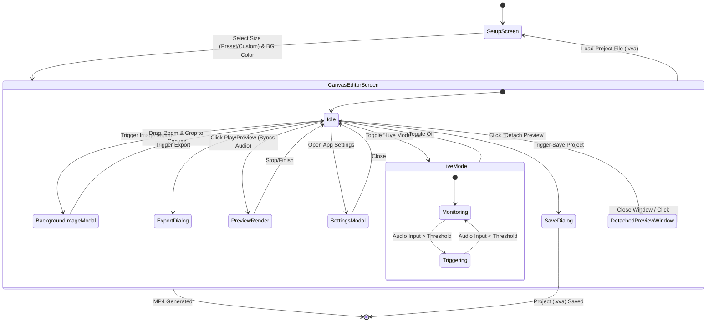
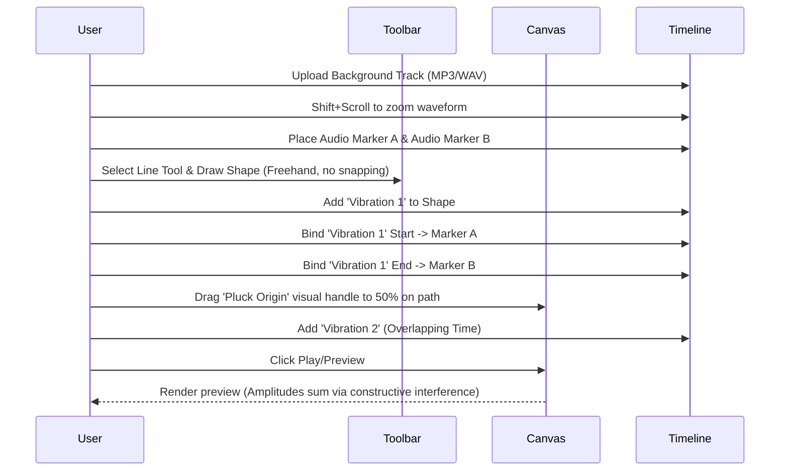

# Vector Vibe Animator - Requirements Document

## 0. Architecture & Environment
* **Platform:** Local Desktop Application (Standalone Binary).
* **Storage Model:** A `.vva` project is a designated directory (or archive) that contains a JSON project file and local copies of all associated audio assets.
* **Rendering Pipeline:** Local execution (e.g., using an integrated library like FFmpeg) generates MP4 files, bypassing any web browser memory or security limitations.
* **Audio Processing:** Support for both pre-recorded tracks (MP3/WAV) and real-time audio streams (Microphone, System Loopback) via the Web Audio API.

## 1. User Flows

### 1.1 Screen Transitions & Modals

### 1.2 Core Drawing & Audio Sync Sequence

## 2. Interface Mockups

### 2.1 Project Setup Screen
| App Header | Action Area | Configuration |
|---|---|---|
| Vector Vibe Animator | `[Button]` New Feed (1080x1080) | `[Input]` Solid Canvas BG Color |
| | `[Button]` New Story (1080x1920) | `[Input]` Custom Width/Height |
| | `[Button]` New Custom Size | |
| | `[Button]` Load Existing Project | |

### 2.2 Main Canvas Editor
| Left Toolbar (Tools) | Center (View) | Right/Bottom (Properties & Audio) |
|---|---|---|
| `[Tool]` Select Obj | Canvas Viewport | **Styling Panel** |
| `[Tool]` Draw Line/Poly | (Masked to chosen ratio) | `[Input]` Stroke Width & Style |
| `[Tool]` Edit Points | `[Handle]` Pluck Node (Draggable) | `[Input]` Stroke / Fill Color |
| `[Action]` Layer ↓ Backward| `[Action]` Pan / Zoom | `[Input]` Corner Radius (Absolute px, no scaling) |
| `[Action]` Layer ⤒ To Front| `[Action]` Play/Preview | **Animation Panel** |
| `[Action] Layer ⤓ To Back | `[Action] Detach Preview | `[List]` Active Animations with `[X]` to delete |
| `[Action] Import Image | | `[Action]` Add New Vibration |
| `[Action] Save Project | | `[Slider]` Frequency (1-10 Scale) |
| `[Action] Export MP4 | | `[Slider]` Amplitude (Absolute px) |
| | | `[Dropdown]` Damping Easing Profile |
| | | **Background & Map Panel** |
| | | `[Input]` Canvas Width/Height |
| | | `[Action]` Import Geopandas Map |
| | | `[List]` Map Features (Selectable as Lines) |
| | | **Timeline / Live Panel** |
| | | `[Toggle]` Live Mode (Mic/System Input) |
| | | `[Dropdown]` Audio Input Device Selector |
| | | `[Timeline]` Audio Waveform (`[+]`/`[-]` Zoom Controls) |
| | | `[Action]` Add/Rename Audio Marker |

### 2.3 Modal Windows
**Background Image Editor**
| `[View]` Interactive Image Viewport (Overlay on Canvas) |
| `[Tool]` Drag, Zoom, and Crop handles |
| `[Button]` Cancel \| `[Button]` Confirm (Fits image to canvas area) |

**Map Feature Selector**
| `[List]` Geopandas layers/features (e.g., roads, rails, boundaries) |
| `[Checkbox]` Select feature to convert to editable VVA Line |
| `[Button]` Import Selected Features |

**Export Dialog**
| `[Label]` Select Export Quality |
| `[Text]` Export covers full length of audio track |
| `[Button]` High (1080p @ 60 FPS) |
| `[Button]` Low (720p @ 30 FPS) |

## 3. Component Details

### 3.1 Setup & Modal Components
* `[Input]` `[Setup_BGColor]` `[Color Picker]` `[Set the default solid color hex code for the canvas background]`
* `[Button]` `[Setup_Feed]` `[Click]` `[Init 1080x1080 boundaries with BG color; route to Editor]`
* `[Button]` `[Setup_Story]` `[Click]` `[Init 1080x1920 boundaries with BG color; route to Editor]`
* `[Button]` `[Setup_Load]` `[Click]` `[Open file browser for proprietary JSON logic file, restore shapes and timeline state]`
* `[Button]` `[Setup_Custom]` `[Click]` `[Init custom dimensions boundaries with BG color; route to Editor]`
* `[Modal]` `[BackgroundImageModal]` `[Confirm Click]` `[Apply transformation to background image so it fits canvas; Close]`
* `[Modal]` `[MapImportModal]` `[Confirm Click]` `[Convert selected geopandas features into VVA line segments; Close]`
* `[Modal]` `[ExportDialog]` `[Click High/Low]` `[Trigger MP4 render pipeline at requested 1080p/60fps or 720p/30fps preset covering full audio duration; route to Save]`

### 3.2 Toolbar Elements
* `[Toggle]` `[Tool_Select]` `[Click]` `[Enable selection, move, and uniform scale; expose Z-order buttons]`
* `[Hotkey]` `[Delete shape/point]` `[Press Backspace/Del]` `[Removes the actively selected shape, or the actively selected point within a shape, recreating line segment between remaining neighbors]`
* `[Toggle]` `[Tool_Draw]` `[Click]` `[Freehand drawing mode. User clicks and drags, and the line follows the cursor continuously. Polygons/closed shapes do not natively support vibration effects in the current scope.]`
* `[Toggle]` `[Tool_EditPts]` `[Click]` `[Global Edit Mode: Displays vertices of ALL shapes on canvas. Drag-to-move any point; click any point to implicitly select its parent shape; double-click segment to insert new point.]`
* `[Action]` `[Action_ZOrder]` `[Click]` `[Modifies rendering array index of the selected object]`
* `[Button]` `[Action_Play]` `[Click]` `[Starts audio playback from timeline and renders synced canvas animation logic sequence]`
* `[Action]` `[Action_SaveProject]` `[Click]` `[Create a project directory, copy required audio tracks into it, and serialize canvas objects, timeline markers, and relative audio file pointers into a JSON representation]`

### 3.3 Properties & Parameters
* `[Input]` `[Stroke/Fill Color]` `[Color Picker]` `[Update selected active object visual style]`
* `[Input]` `[GlobalRadius]` `[Slider]` `[Apply uniform curve radius absolute px to all inner angles of the selected shape. Uses a strict clamping rule where the radius cannot exceed the length of the closest adjacent segment.]`
* `[List]` `[AnimStack]` `[Select]` `[Select particular vibration instance to isolate its slider controls/handles]`
* `[Button]` `[DeleteAnim_X]` `[Click]` `[Icon next to each list item in AnimStack to permanently remove that specific animation layer]`
* `[Button]` `[AddAnim]` `[Click]` `[Add new vibration instance to the AnimStack array of the shape]`
* `[Node]` `[PluckHandle]` `[Drag 0-100% Path]` `[Visual node over shape geometry that sets origin point constraint for selected animation]`
* `[Slider]` `[VibrateFreq]` `[Change: 1-10]` `[Updates wave frequency calculation of chosen active animation]`
* `[Slider]` `[VibrateAmp]` `[Change: Abs px]` `[Updates max pixel displacement of chosen active animation. Multiple animations on same shape sum constructively.]`
* `[Dropdown]` `[AnimEasing]` `[Select: Linear, Exponential]` `[Determines the mathematical decay profile for the wave's damping phase. Cutoff threshold resets amplitude to 0 once displacement < 0.1 px.]`
* `[Input]` `[AudioTriggerThreshold]` `[Slider: 0-100%]` `[In Live Mode, sets the amplitude threshold required to trigger a pluck.]`
* `[Dropdown]` `[AudioTriggerBand]` `[Select: Bass, Mid, Treble, Full]` `[Filters the incoming audio signal to trigger only on specific frequency ranges.]`
* `[Physics]` `[Wave Mode]` `[Internal]` `[1-D wave equation logic. The wave travels *outward* from the Pluck Origin node along the line segments rather than acting strictly as a standing wave.]`
* `[Physics]` `[Interaction with Rounded Corners]` `[Internal]` `[The 1-D wave travels along the straight segments of a line. The rounded corners (defined by \`GlobalRadius\`) are not animated and remain static. The wave propagation should continue on the next segment as if the corner was a single, non-displaced point.]`

### 3.4 Timeline & Audio Sync
* `[TimelineTrack]` `[Waveform]` `[Scrub/Drag]` `[Updates global time constraint for authoring]`
* `[Action]` `[Timeline Zoom]` `[Scroll Wheel + Shift OR UI Zoom Buttons]` `[Horizontally stretches/compresses the audio waveform for precision editing]`
* `[Button]` `[UploadAudio]` `[Click]` `[Load Local MP3 or WAV file; Render waveform visualization]`
* `[Button/Action]` `[AddMarker]` `[Input]` `[Three ways to add: 1) Double-click waveform. 2) Press 'M' to add at playhead. 3) Right-click waveform context menu to 'Add at Cursor' or 'Add at Playhead'. New markers are automatically assigned a generic name (M1, M2, M3, etc.) based on creation order.]`
* `[Marker]` `[TimeMarker]` `[Interaction]` `[Displays a yellow rectangle above the marker line showing its name. Double-clicking the rectangle transforms it into an editable textbox; pressing Enter updates the marker's name. Dragging L/R updates marker timestamp. UI enforces a "markers cannot cross" restraint preventing Start/End markers from inverting. Playhead auto-scrolls waveform to stay in view during active playback.]`
* `[Dropdown]` `[AnimStart]` `[Select Marker]` `[Binds current animation's start trigger to Marker ID. The list is sorted by time and displayed as "Name (Time)", e.g., "M1 (00:01.500)".]`
* `[Dropdown]` `[AnimEnd]` `[Select Marker]` `[Binds current animation's end/damping trigger to Marker ID. The list is sorted by time and displayed as "Name (Time)".]`
* `[LiveAudio]` `[InputSelector]` `[Dropdown]` `[List all system audio input devices; switch active stream on change.]`
* `[LiveAudio]` `[Monitor]` `[Visualizer]` `[Simple real-time level meter showing incoming signal strength.]`
* `[Window]` `[DetachedPreview]` `[Interaction]` `[Dedicated window showing only the animation canvas. Real-time sync with main editor. Closing the window or clicking "Reattach" in the main editor restores the preview to the main window.]`
* `[Map]` `[GeopandasLoader]` `[Internal]` `[Python/Node bridge to load spatial data; extract LineString/Polygon coordinates for conversion to VVA paths.]`

## 4. Implementation Roadmap

### Phase 1: Core Engine & Visualization MVP
**Goal:** Prove the foundational geometry and user interaction mechanics.
* 1080x1080 & 1080x1920 canvas setup and Solid Color backgrounds.
* Basic freehand Line drawing (`[Tool_Draw]`), moving, scaling, and vertex editing (`[Tool_EditPts]`).
* Basic visual styling (Stroke Width, Stroke Color).
* Z-Ordering data structure (`Bring Forward`, `Send Backward`).
* Absolute pixel-based corner smoothing/clamping for vertices.
* Basic JSON serialization of canvas geometry to prove data structures.

### Phase 2: Audio/Timeline Authoring Logic
**Goal:** Build the temporal sequencing structure.
* Standalone audio playback from a selected local file.
* UI for the Audio Waveform Timeline with zoom controls.
* Dropping, dragging, and validating absolute Time Markers.
* Upgrading save logic to create the `.vva` directory bundle and copy audio files.
* Core Sync Engine linking the canvas `requestAnimationFrame` clock to the audio playback.

### Phase 3: Physics & Animation
**Goal:** Implement the math that makes the application unique.
* The 1D wave equation propagating from the Pluck Origin handle.
* Constructive interference when overlapping animations exist on the same line segment.

### Phase 4: Polish & Export Media
**Goal:** Get the project ready for public social media distribution.
* The FFmpeg local execution pipeline to stitch canvas frames and audio.
* High (1080p/60fps) and Low (720p/30fps) MP4 export defaults.
* Interactive Background Image controls (Drag, Zoom, Crop).
* Tweakable Canvas Size in UI.
* Geopandas Map integration and feature-to-line conversion.
### Phase 5: Real-Time Audio & Live Performance
**Goal:** Enable responsive animation from external sound sources.
* Implementation of `LiveAudioAdapter` using `getUserMedia` and `AnalyserNode`.
* Audio device enumeration and selection UI.
* Reactive trigger logic (Threshold + Frequency Band filtering).
* Detached Preview Window for dedicated animation display.
* Loopback audio support for recording system output (OS-dependent).
